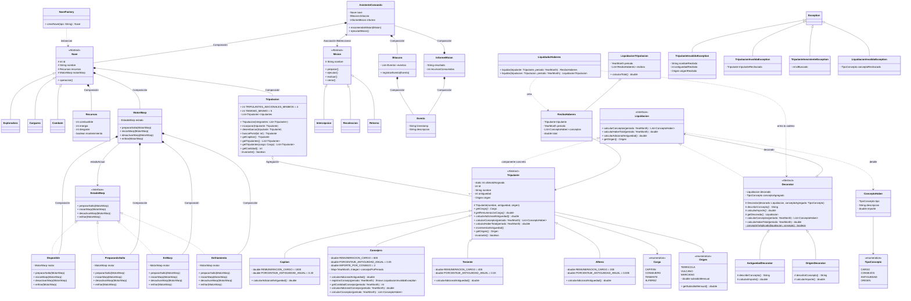

```mermaid
classDiagram
    %% Módulo Nave y Fábrica (Factory)
    class Nave {
        <<Abstract>>
        # int id
        # String nombre
        # Recursos recursos
        # MotorWarp motorWarp
        + operacion()
    }
    class Exploradora {
    }
    class Carguero {
    }
    class Combate {
    }
    class NaveFactory {
        + crearNave(tipo: String) Nave
    }
    class Recursos {
        - int combustible
        - int energia
        - int desgaste
        - boolean mantenimiento
    }

    Nave <|-- Exploradora
    Nave <|-- Carguero
    Nave <|-- Combate
    NaveFactory ..> Nave : instancian
    Nave *-- Recursos : Composición
    Nave *-- MotorWarp : Composición
    Nave *-- Tripulacion : Composición

    %% Módulo Motor Warp (State)
    class MotorWarp {
        - EstadoWarp estado
        + prepararSalto(MotorWarp)
        + iniciarWarp(MotorWarp)
        + desactivarWarp(MotorWarp)
        + enfriar(MotorWarp)
    }
    class EstadoWarp {
        <<Interface>>
        + prepararSalto(MotorWarp)
        + iniciarWarp(MotorWarp)
        + desactivarWarp(MotorWarp)
        + enfriar(MotorWarp)
    }
    class Disponible {
        - MotorWarp motor
        + prepararSalto(MotorWarp)
        + iniciarWarp(MotorWarp)
        + desactivarWarp(MotorWarp)
        + enfriar(MotorWarp)
    }
    class PreparandoSalto {
        - MotorWarp motor
        + prepararSalto(MotorWarp)
        + iniciarWarp(MotorWarp)
        + desactivarWarp(MotorWarp)
        + enfriar(MotorWarp)
    }
    class EnWarp {
        - MotorWarp motor
        + prepararSalto(MotorWarp)
        + iniciarWarp(MotorWarp)
        + desactivarWarp(MotorWarp)
        + enfriar(MotorWarp)
    }
    class Enfriamiento {
        - MotorWarp motor
        + prepararSalto(MotorWarp)
        + iniciarWarp(MotorWarp)
        + desactivarWarp(MotorWarp)
        + enfriar(MotorWarp)
    }

    EstadoWarp <|.. Disponible
    EstadoWarp <|.. PreparandoSalto
    EstadoWarp <|.. EnWarp
    EstadoWarp <|.. Enfriamiento
    MotorWarp *-- Disponible : Composición
    MotorWarp *-- PreparandoSalto : Composición
    MotorWarp *-- EnWarp : Composición
    MotorWarp *-- Enfriamiento : Composición
    MotorWarp --> EstadoWarp : estadoActual

    %% Módulo Misiones (Template Method)
    class Mision {
        <<Abstract>>
        # String nombre
        + preparar()
        + ejecutar()
        + evaluar()
        + cerrar()
    }
    class Intercepcion {
    }
    class Recoleccion {
    }
    class Retorno {
    }

    Mision <|-- Intercepcion
    Mision <|-- Recoleccion
    Mision <|-- Retorno

    %% Módulo Asistente de Comando, Bitácora e Informe
    class AsistenteComando {
        - Nave nave
        - Bitacora bitacora
        - InformeMision informe
        + encomendarMision(Mision)
        + ejecutarMision()
    }
    class Bitacora {
        - List~Evento~ eventos
        + registrarEvento(Evento)
    }
    class Evento {
        - String timestamp
        - String descripcion
    }
    class InformeMision {
        - String resultado
        - int recursosConsumidos
    }

    AsistenteComando *-- Nave : Composición
    AsistenteComando *-- Bitacora : Composición
    AsistenteComando --* InformeMision : Composición
    AsistenteComando <--> Mision : Asociación Bidireccional
    Bitacora *-- Evento : Composición
    InformeMision *-- Evento : Composición

    %% Módulo Tripulación (E1-04)
    class Tripulacion {
        + int TRIPULANTES_ADICIONALES_MINIMOS = 4
        + int TAMANIO_MINIMO = 5
        - List~Tripulante~ tripulantes
        + Tripulacion(integrantes: List~Tripulante~)
        + incorporar(tripulante: Tripulante)
        + desembarcar(tripulante: Tripulante)
        + buscarPorId(id: int) Tripulante
        + getCapitan() Tripulante
        + getTripulantes() List~Tripulante~
        + getTripulantes(cargo: Cargo) List~Tripulante~
        + getCantidad() int
        - invariante() boolean
    }
    class Tripulante {
        <<Abstract>>
        - static int ultimoIdAsignado
        - int id
        - String nombre
        - int antiguedad
        - Origen origen
        # Tripulante(nombre, antiguedad, origen)
        + getCargo() Cargo*
        # getRemuneracionCargo() double*
        + calcularAdicionalAntiguedad() double*
        + calcularConceptos(periodo: YearMonth) List~ConceptoHaber~
        + calcularHaberTotal(periodo: YearMonth) double
        + incrementarAntiguedad()
        + getOrigen() Origen
        - invariante() boolean
    }
    class Capitan {
        - double REMUNERACION_CARGO = 1000
        - double PORCENTAJE_ANTIGUEDAD_ANUAL = 0.20
        + calcularAdicionalAntiguedad() double
    }
    class Consejero {
        - double REMUNERACION_CARGO = 600
        - double PORCENTAJE_ANTIGUEDAD_ANUAL = 0.05
        - double IMPORTE_POR_CONSEJO = 2
        - Map~YearMonth, Integer~ consejosPorPeriodo
        + calcularAdicionalAntiguedad() double
        + registrarConsejo(periodo: YearMonth) throws LiquidacionInvalidaException
        + getCantidadConsejos(periodo: YearMonth) int
        + calcularAdicionalConsejos(periodo: YearMonth) double
        + calcularConceptos(periodo: YearMonth) List~ConceptoHaber~
    }
    class Teniente {
        - double REMUNERACION_CARGO = 400
        - double PORCENTAJE_ANTIGUEDAD_ANUAL = 0.03
        + calcularAdicionalAntiguedad() double
    }
    class Alferez {
        - double REMUNERACION_CARGO = 200
        - double PORCENTAJE_ANTIGUEDAD_ANUAL = 0.005
        + calcularAdicionalAntiguedad() double
    }
    class Cargo {
        <<enumeration>>
        CAPITAN
        CONSEJERO
        TENIENTE
        ALFEREZ
    }
    class Origen {
        <<enumeration>>
        TERRICOLA
        VULCANO
        MARCIANO
        - double subsidioMensual
        + getSubsidioMensual() double
    }

    Tripulacion o-- "5..*" Tripulante : Agregación
    Tripulante <|-- Capitan
    Tripulante <|-- Consejero
    Tripulante <|-- Teniente
    Tripulante <|-- Alferez
    Tripulante --> Cargo
    Tripulante --> Origen

    %% Módulo Liquidación de haberes (Decorator - E1-08)
    class Liquidacion {
        <<Interface>>
        + calcularConceptos(periodo: YearMonth) List~ConceptoHaber~
        + calcularHaberTotal(periodo: YearMonth) double
        + calcularAdicionalAntiguedad() double
        + getOrigen() Origen
    }
    class Decorator {
        <<Abstract>>
        - Liquidacion decorado
        - TipoConcepto conceptoAgregado
        # Decorator(decorado: Liquidacion, conceptoAgregado: TipoConcepto)
        # describirConcepto() String*
        # calcularImporte() double*
        # getDecorado() Liquidacion
        + calcularConceptos(periodo: YearMonth) List~ConceptoHaber~
        + calcularHaberTotal(periodo: YearMonth) double
        - conceptoYaAplicado(liquidacion, concepto)$ boolean
    }
    class AntiguedadDecorator {
        # describirConcepto() String
        # calcularImporte() double
    }
    class OrigenDecorator {
        # describirConcepto() String
        # calcularImporte() double
    }
    class ConceptoHaber {
        - TipoConcepto tipo
        - String descripcion
        - double importe
    }
    class TipoConcepto {
        <<enumeration>>
        CARGO
        CONSEJOS
        ANTIGUEDAD
        ORIGEN
    }
    class LiquidadorHaberes {
        + liquidar(tripulante: Tripulante, periodo: YearMonth) ReciboHaberes
        + liquidar(tripulacion: Tripulacion, periodo: YearMonth) LiquidacionTripulacion
    }
    class ReciboHaberes {
        - Tripulante tripulante
        - YearMonth periodo
        - List~ConceptoHaber~ conceptos
        - double total
    }
    class LiquidacionTripulacion {
        - YearMonth periodo
        - List~ReciboHaberes~ recibos
        + calcularTotal() double
    }

    Liquidacion <|.. Tripulante : componente concreto
    Liquidacion <|.. Decorator
    Decorator <|-- AntiguedadDecorator
    Decorator <|-- OrigenDecorator
    Decorator o--> Liquidacion : decorado
    Liquidacion ..> ConceptoHaber : detalle
    ConceptoHaber --> TipoConcepto
    LiquidadorHaberes ..> Decorator : arma la cadena
    LiquidadorHaberes ..> ReciboHaberes : crea
    LiquidacionTripulacion o-- ReciboHaberes
    ReciboHaberes --> Tripulante

    %% Excepciones propias (comprobadas, extienden Exception)
    class TripulanteInvalidoException {
        - String nombreRecibido
        - int antiguedadRecibida
        - Origen origenRecibido
    }
    class TripulacionInvalidaException {
        - Tripulante tripulanteRechazado
    }
    class TripulanteInexistenteException {
        - int idBuscado
    }
    class LiquidacionInvalidaException {
        - TipoConcepto conceptoRechazado
    }
    Exception <|-- TripulanteInvalidoException
    Exception <|-- TripulacionInvalidaException
    Exception <|-- TripulanteInexistenteException
    Exception <|-- LiquidacionInvalidaException
```