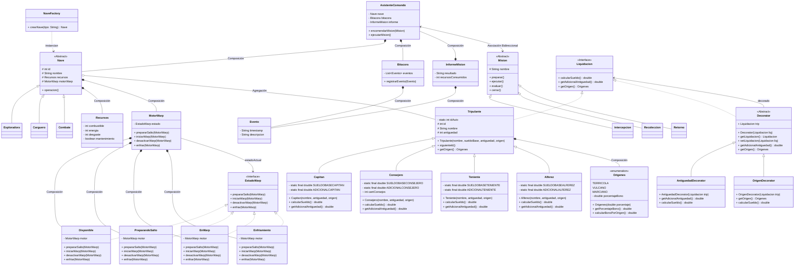

```mermaid
classDiagram
    %% Módulo Nave y Fábrica (Factory)
    class Nave {
        <<Abstract>>
        # int id
        # String nombre
        # Recursos recursos
        # MotorWarp motorWarp
        + operacion()
    }
    class Exploradora {
    }
    class Carguero {
    }
    class Combate {
    }
    class NaveFactory {
        + crearNave(tipo: String) Nave
    }
    class Recursos {
        - int combustible
        - int energia
        - int desgaste
        - boolean mantenimiento
    }

    Nave <|-- Exploradora
    Nave <|-- Carguero
    Nave <|-- Combate
    NaveFactory ..> Nave : instancian
    Nave *-- Recursos : Composición
    Nave *-- MotorWarp : Composición
    Nave o-- Tripulante : Agregación

    %% Módulo Motor Warp (State)
    class MotorWarp {
        - EstadoWarp estado
        + prepararSalto(MotorWarp)
        + iniciarWarp(MotorWarp)
        + desactivarWarp(MotorWarp)
        + enfriar(MotorWarp)
    }
    class EstadoWarp {
        <<Interface>>
        + prepararSalto(MotorWarp)
        + iniciarWarp(MotorWarp)
        + desactivarWarp(MotorWarp)
        + enfriar(MotorWarp)
    }
    class Disponible {
        - MotorWarp motor
        + prepararSalto(MotorWarp)
        + iniciarWarp(MotorWarp)
        + desactivarWarp(MotorWarp)
        + enfriar(MotorWarp)
    }
    class PreparandoSalto {
        - MotorWarp motor
        + prepararSalto(MotorWarp)
        + iniciarWarp(MotorWarp)
        + desactivarWarp(MotorWarp)
        + enfriar(MotorWarp)
    }
    class EnWarp {
        - MotorWarp motor
        + prepararSalto(MotorWarp)
        + iniciarWarp(MotorWarp)
        + desactivarWarp(MotorWarp)
        + enfriar(MotorWarp)
    }
    class Enfriamiento {
        - MotorWarp motor
        + prepararSalto(MotorWarp)
        + iniciarWarp(MotorWarp)
        + desactivarWarp(MotorWarp)
        + enfriar(MotorWarp)
    }

    EstadoWarp <|.. Disponible
    EstadoWarp <|.. PreparandoSalto
    EstadoWarp <|.. EnWarp
    EstadoWarp <|.. Enfriamiento
    MotorWarp *-- Disponible : Composición
    MotorWarp *-- PreparandoSalto : Composición
    MotorWarp *-- EnWarp : Composición
    MotorWarp *-- Enfriamiento : Composición
    MotorWarp --> EstadoWarp : estadoActual

    %% Módulo Misiones (Template Method)
    class Mision {
        <<Abstract>>
        # String nombre
        + preparar()
        + ejecutar()
        + evaluar()
        + cerrar()
    }
    class Intercepcion {
    }
    class Recoleccion {
    }
    class Retorno {
    }

    Mision <|-- Intercepcion
    Mision <|-- Recoleccion
    Mision <|-- Retorno

    %% Módulo Asistente de Comando, Bitácora e Informe
    class AsistenteComando {
        - Nave nave
        - Bitacora bitacora
        - InformeMision informe
        + encomendarMision(Mision)
        + ejecutarMision()
    }
    class Bitacora {
        - List~Evento~ eventos
        + registrarEvento(Evento)
    }
    class Evento {
        - String timestamp
        - String descripcion
    }
    class InformeMision {
        - String resultado
        - int recursosConsumidos
    }

    AsistenteComando *-- Nave : Composición
    AsistenteComando *-- Bitacora : Composición
    AsistenteComando --* InformeMision : Composición
    AsistenteComando <--> Mision : Asociación Bidireccional
    Bitacora *-- Evento : Composición
    InformeMision *-- Evento : Composición

    %% Módulo Tripulación y Haberes (Decorator)
    class Liquidacion {
        <<Interface>>
        + calcularSueldo() double
        + getAdicionalAntiguedad() double
        + getOrigen() Origenes
    }
    class Origenes {
        <<enumeration>>
        TERRICOLA
        VULCANO
        MARCIANO
        - double porcentajeBono
        + Origenes(double porcentaje)
        + getPorcentajeBono() double
        + calcularBonoPorOrigen() double
    }
    class Tripulante {
        - static int idAuto
        # int id
        # String nombre
        # int antiguedad
        + Tripulante(nombre, sueldoBase, antiguedad, origen)
        + siguienteId()
        + getOrigen() Origenes
    }
    class Capitan {
        - static final double SUELDOBASECAPITAN
        - static final double ADICIONALCAPITAN
        + Capitan(nombre, antiguedad, origen)
        + calcularSueldo() double
        + getAdicionalAntiguedad() double
    }
    class Consejero {
        - static final double SUELDOBASECONSEJERO
        - static final double ADICIONALCONSEJERO
        ~ int cantConsejos
        + Consejero(nombre, antiguedad, origen)
        + calcularSueldo() double
        + getAdicionalAntiguedad() double
    }
    class Teniente {
        - static final double SUELDOBASETENIENTE
        - static final double ADICIONALTENIENTE
        + Teniente(nombre, antiguedad, origen)
        + calcularSueldo() double
        + getAdicionalAntiguedad() double
    }
    class Alferez {
        - static final double SUELDOBASEALFEREZ
        - static final double ADICIONALALFEREZ
        + Alferez(nombre, antiguedad, origen)
        + calcularSueldo() double
        + getAdicionalAntiguedad() double
    }
    class Decorator {
        <<Abstract>>
        + Liquidacion trip
        + Decorator(Liquidacion liq)
        + getLiquidacion() Liquidacion
        + setLiquidacion(Liquidacion liq)
        + getAdicionalAntiguedad() double
        + getOrigen() Origenes
    }
    class AntiguedadDecorator {
        + AntiguedadDecorator(Liquidacion trip)
        + getAdicionalAntiguedad() double
        + calcularSueldo() double
    }
    class OrigenDecorator {
        + OrigenDecorator(Liquidacion trip)
        + getOrigen() Origenes
        + calcularSueldo() double
    }

    Liquidacion <|.. Tripulante
    Liquidacion <|.. Decorator
    Tripulante <|-- Capitan
    Tripulante <|-- Consejero
    Tripulante <|-- Teniente
    Tripulante <|-- Alferez
    Tripulante *-- Origenes : Composición
    Decorator <|-- AntiguedadDecorator
    Decorator <|-- OrigenDecorator
    Decorator --> Liquidacion : decorado
```