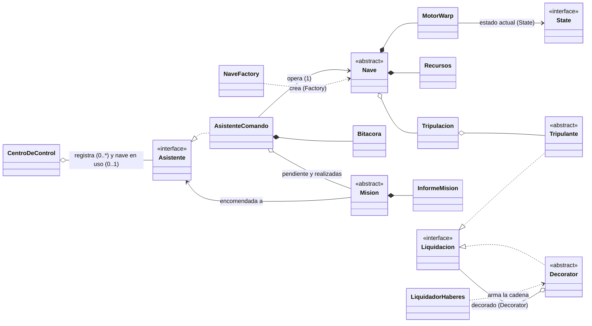
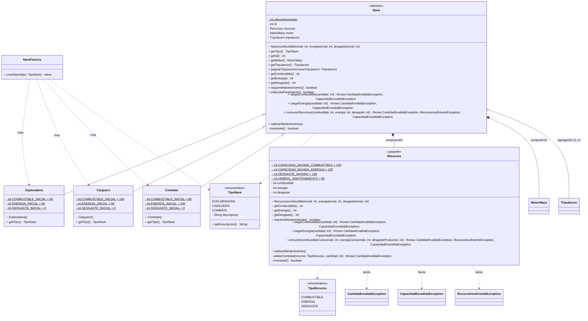
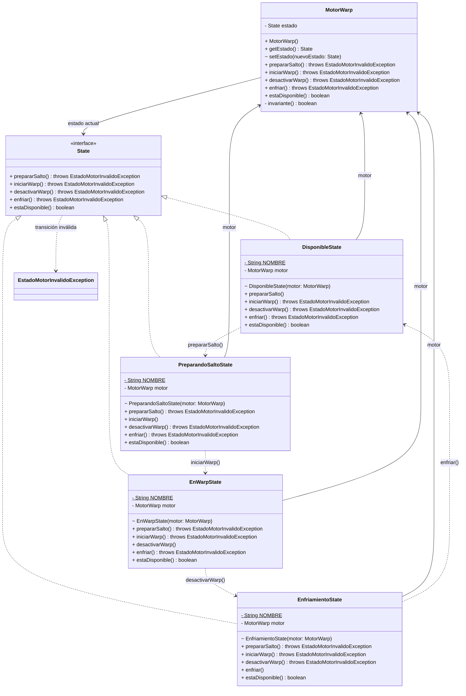
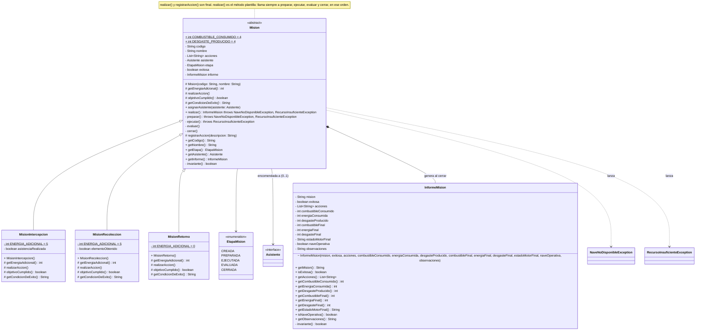
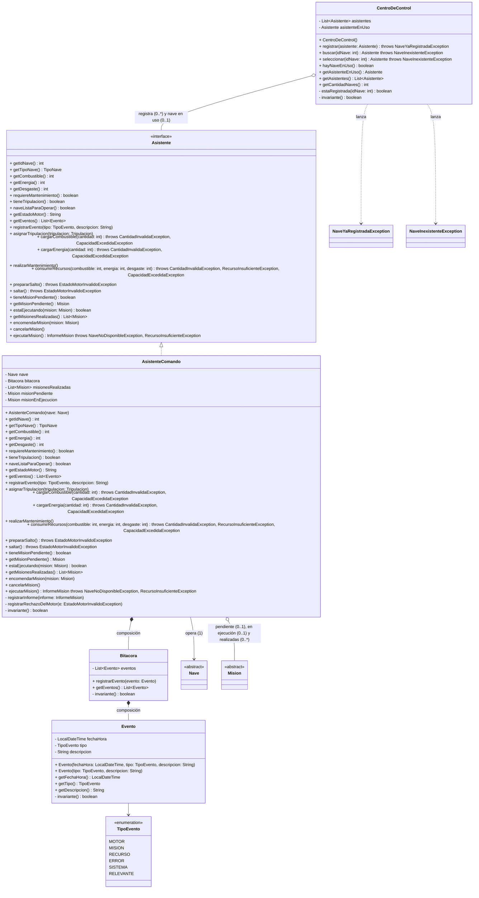
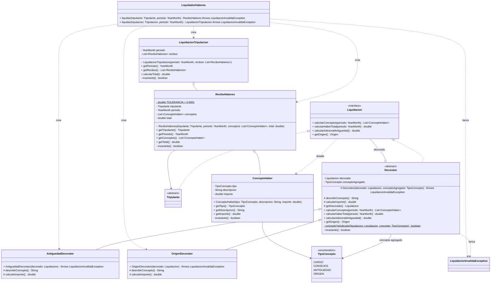

# Diagrama de clases — Entrega 1

Primero una **vista general** con las clases y sus relaciones principales; después, un diagrama por módulo con
atributos, métodos y excepciones, tal como están en el código.

**Notación:** `+` público, `-` privado, `#` protegido, `~` de paquete; `*` al final = abstracto; `$` al final = estático
(las constantes son `static final`). Se omiten `toString()`, los constructores por defecto sin código y los constructores privados de los `enum`.
`throws` indica las excepciones comprobadas que el método declara. Flecha continua (`-->`, `*--`, `o--`) = el atributo
existe; flecha punteada (`..>`) = dependencia (usa, crea o lanza). `App` (demostración por consola) no forma parte del modelo.

## 1. Vista general

## 2. Nave y fábrica (E1-01, E1-07 Factory, E1-09)

## 3. Motor Warp (E1-02, patrón State)

Cada estado concreto implementa sin `throws` su única transición válida y rechaza las otras tres con
`EstadoMotorInvalidoException`. Los constructores de los estados y `setEstado()` son de paquete: sólo el motor y los
estados pueden cambiar el estado.

## 4. Misión (E1-06 Template Method, E1-10)

## 5. Asistente, centro de control y Bitácora (E1-03, E1-05; Aclaración R1, R2, R4 y R5)

`Bitacora` y `Evento` rechazan los eventos nulos, vacíos o fuera de orden con `IllegalArgumentException`
(excepción no comprobada, por eso no figura en `throws`).

## 6. Tripulación (E1-04)

```mermaid
classDiagram
    class Tripulacion {
        + int TRIPULANTES_ADICIONALES_MINIMOS = 4$
        + int TAMANIO_MINIMO = 5$
        - List~Tripulante~ tripulantes
        + Tripulacion(integrantes: List~Tripulante~) throws TripulacionInvalidaException
        + incorporar(tripulante: Tripulante) throws TripulacionInvalidaException
        + desembarcar(tripulante: Tripulante) throws TripulacionInvalidaException
        + buscarPorId(id: int) Tripulante throws TripulanteInexistenteException
        + getCapitan() Tripulante
        + getTripulantes() List~Tripulante~
        + getTripulantes(cargo: Cargo) List~Tripulante~
        + getCantidad() int
        - validarIncorporacion(tripulante: Tripulante) throws TripulacionInvalidaException
        - contarCapitanes() int
        - invariante() boolean
    }
    class Tripulante {
        <<abstract>>
        - int ultimoIdAsignado$
        - int id
        - String nombre
        - int antiguedad
        - Origen origen
        # Tripulante(nombre: String, antiguedad: int, origen: Origen) throws TripulanteInvalidoException
        - siguienteId() int$
        + getCargo() Cargo*
        # getRemuneracionCargo() double*
        + calcularAdicionalAntiguedad() double*
        + calcularConceptos(periodo: YearMonth) List~ConceptoHaber~
        + calcularHaberTotal(periodo: YearMonth) double
        + incrementarAntiguedad()
        + getId() int
        + getNombre() String
        + getAntiguedad() int
        + getOrigen() Origen
        - invariante() boolean
    }
    class Capitan {
        - double REMUNERACION_CARGO = 1000$
        - double PORCENTAJE_ANTIGUEDAD_ANUAL = 0.20$
        + Capitan(nombre: String, antiguedad: int, origen: Origen) throws TripulanteInvalidoException
        + getCargo() Cargo
        # getRemuneracionCargo() double
        + calcularAdicionalAntiguedad() double
    }
    class Consejero {
        - double REMUNERACION_CARGO = 600$
        - double PORCENTAJE_ANTIGUEDAD_ANUAL = 0.05$
        - double IMPORTE_POR_CONSEJO = 2$
        - List~YearMonth~ periodosDeConsejos
        + Consejero(nombre: String, antiguedad: int, origen: Origen) throws TripulanteInvalidoException
        + getCargo() Cargo
        # getRemuneracionCargo() double
        + calcularAdicionalAntiguedad() double
        + registrarConsejo(periodo: YearMonth) throws LiquidacionInvalidaException
        + getCantidadConsejos(periodo: YearMonth) int
        + calcularAdicionalConsejos(periodo: YearMonth) double
        + calcularConceptos(periodo: YearMonth) List~ConceptoHaber~
        - invarianteConsejos() boolean
    }
    class Teniente {
        - double REMUNERACION_CARGO = 400$
        - double PORCENTAJE_ANTIGUEDAD_ANUAL = 0.03$
        + Teniente(nombre: String, antiguedad: int, origen: Origen) throws TripulanteInvalidoException
        + getCargo() Cargo
        # getRemuneracionCargo() double
        + calcularAdicionalAntiguedad() double
    }
    class Alferez {
        - double REMUNERACION_CARGO = 200$
        - double PORCENTAJE_ANTIGUEDAD_ANUAL = 0.005$
        + Alferez(nombre: String, antiguedad: int, origen: Origen) throws TripulanteInvalidoException
        + getCargo() Cargo
        # getRemuneracionCargo() double
        + calcularAdicionalAntiguedad() double
    }
    class Cargo {
        <<enumeration>>
        CAPITAN
        CONSEJERO
        TENIENTE
        ALFEREZ
        - String nombre
        + getNombre() String
    }
    class Origen {
        <<enumeration>>
        TERRICOLA
        VULCANO
        MARCIANO
        - String nombre
        - double subsidioMensual
        + getNombre() String
        + getSubsidioMensual() double
    }
    class Liquidacion
    <<interface>> Liquidacion
    class TripulacionInvalidaException
    class TripulanteInexistenteException
    class TripulanteInvalidoException
    class LiquidacionInvalidaException

    Tripulacion o-- Tripulante : agregación (5..*)
    Liquidacion <|.. Tripulante : componente concreto
    Tripulante <|-- Capitan
    Tripulante <|-- Consejero
    Tripulante <|-- Teniente
    Tripulante <|-- Alferez
    Tripulante ..> Cargo
    Tripulante --> Origen
    Tripulacion ..> TripulacionInvalidaException : lanza
    Tripulacion ..> TripulanteInexistenteException : lanza
    Tripulante ..> TripulanteInvalidoException : lanza
    Consejero ..> LiquidacionInvalidaException : lanza
```

## 7. Liquidación de haberes (E1-08, patrón Decorator)

## 8. Excepciones propias (comprobadas: extienden `Exception`)

```mermaid
classDiagram
    class Exception
    class CantidadInvalidaException {
        - TipoRecurso recurso
        - int cantidadRecibida
        + CantidadInvalidaException(recurso: TipoRecurso, cantidadRecibida: int)
        + getRecurso() TipoRecurso
        + getCantidadRecibida() int
    }
    class CapacidadExcedidaException {
        - TipoRecurso recurso
        - int valorActual
        - int cantidadSolicitada
        - int maximo
        + CapacidadExcedidaException(recurso: TipoRecurso, valorActual: int, cantidadSolicitada: int, maximo: int)
        + getRecurso() TipoRecurso
        + getValorActual() int
        + getCantidadSolicitada() int
        + getMaximo() int
    }
    class RecursoInsuficienteException {
        - TipoRecurso recurso
        - int disponible
        - int cantidadSolicitada
        + RecursoInsuficienteException(recurso: TipoRecurso, disponible: int, cantidadSolicitada: int)
        + getRecurso() TipoRecurso
        + getDisponible() int
        + getCantidadSolicitada() int
    }
    class EstadoMotorInvalidoException {
        - String estadoActual
        + EstadoMotorInvalidoException(mensaje: String, estadoActual: String)
        + getEstadoActual() String
    }
    class NaveNoDisponibleException {
        - String codigoMision
        - boolean tieneTripulacion
        - boolean requiereMantenimiento
        - String estadoMotor
        + NaveNoDisponibleException(codigoMision: String, tieneTripulacion: boolean, requiereMantenimiento: boolean, estadoMotor: String)
        + getCodigoMision() String
        + tieneTripulacion() boolean
        + requiereMantenimiento() boolean
        + getEstadoMotor() String
    }
    class NaveInexistenteException {
        - int idNaveBuscada
        + NaveInexistenteException(idNaveBuscada: int)
        + getIdNaveBuscada() int
    }
    class NaveYaRegistradaException {
        - int idNave
        + NaveYaRegistradaException(idNave: int)
        + getIdNave() int
    }
    class TripulanteInvalidoException {
        - String nombreRecibido
        - int antiguedadRecibida
        - Origen origenRecibido
        + TripulanteInvalidoException(mensaje: String, nombreRecibido: String, antiguedadRecibida: int, origenRecibido: Origen)
        + getNombreRecibido() String
        + getAntiguedadRecibida() int
        + getOrigenRecibido() Origen
    }
    class TripulacionInvalidaException {
        - Tripulante tripulanteRechazado
        + TripulacionInvalidaException(mensaje: String, tripulanteRechazado: Tripulante)
        + getTripulanteRechazado() Tripulante
    }
    class TripulanteInexistenteException {
        - int idBuscado
        + TripulanteInexistenteException(idBuscado: int)
        + getIdBuscado() int
    }
    class LiquidacionInvalidaException {
        - TipoConcepto conceptoRechazado
        + LiquidacionInvalidaException(mensaje: String, conceptoRechazado: TipoConcepto)
        + getConceptoRechazado() TipoConcepto
    }

    Exception <|-- CantidadInvalidaException
    Exception <|-- CapacidadExcedidaException
    Exception <|-- RecursoInsuficienteException
    Exception <|-- EstadoMotorInvalidoException
    Exception <|-- NaveNoDisponibleException
    Exception <|-- NaveInexistenteException
    Exception <|-- NaveYaRegistradaException
    Exception <|-- TripulanteInvalidoException
    Exception <|-- TripulacionInvalidaException
    Exception <|-- TripulanteInexistenteException
    Exception <|-- LiquidacionInvalidaException
```

